# Architecture Documentation

## Overview

This document describes the architecture of the 3D Space Exploration application built with Three.js. The application follows a modular architecture pattern with clear separation of concerns, making it maintainable and extensible for AI/data integration.

## System Architecture

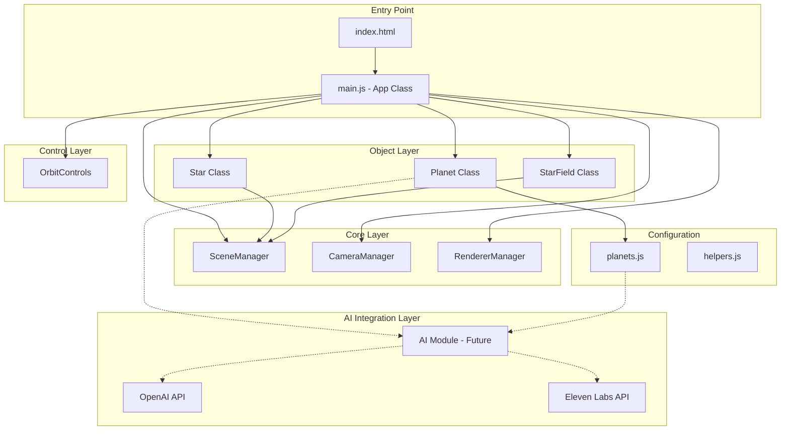

## Component Architecture

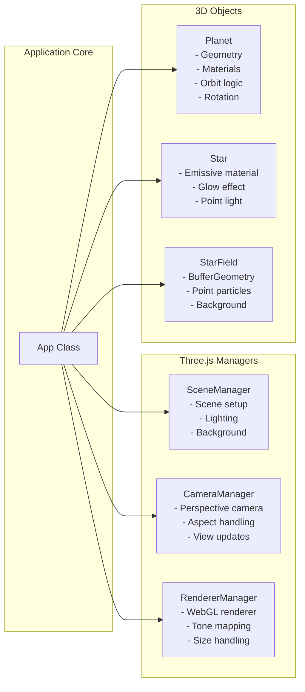

## Data Flow Architecture

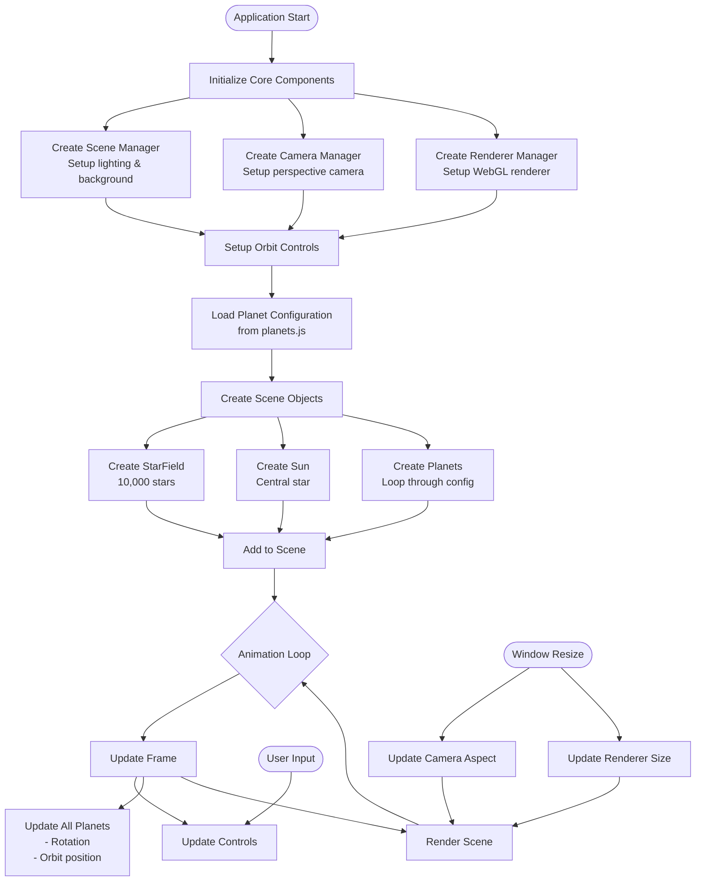

## Class Structure

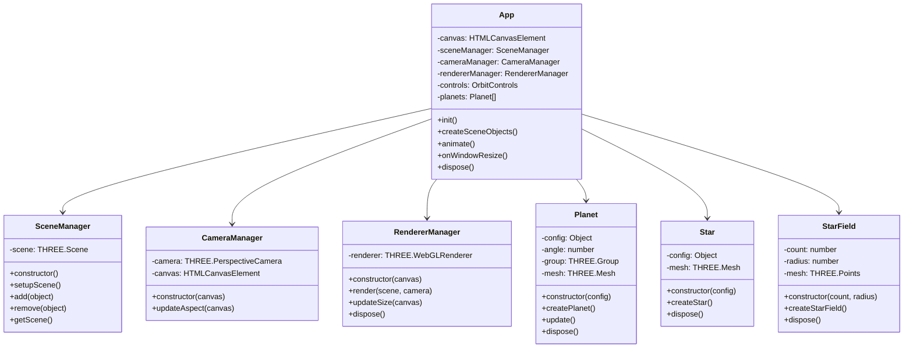

## Module Organization

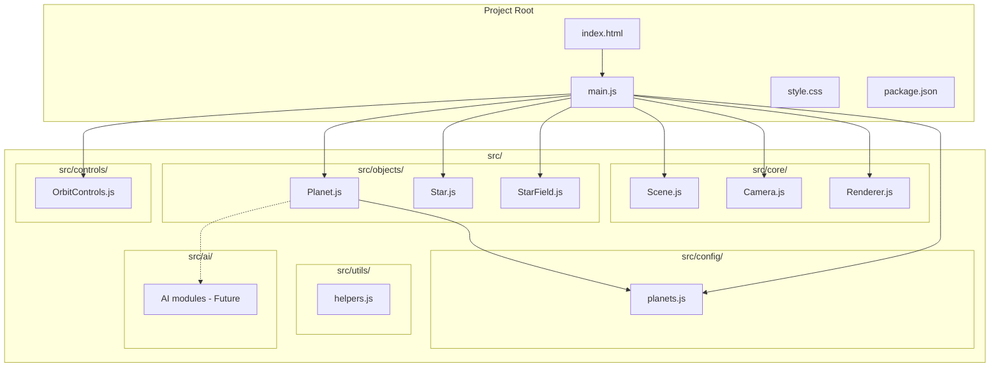

## Rendering Pipeline

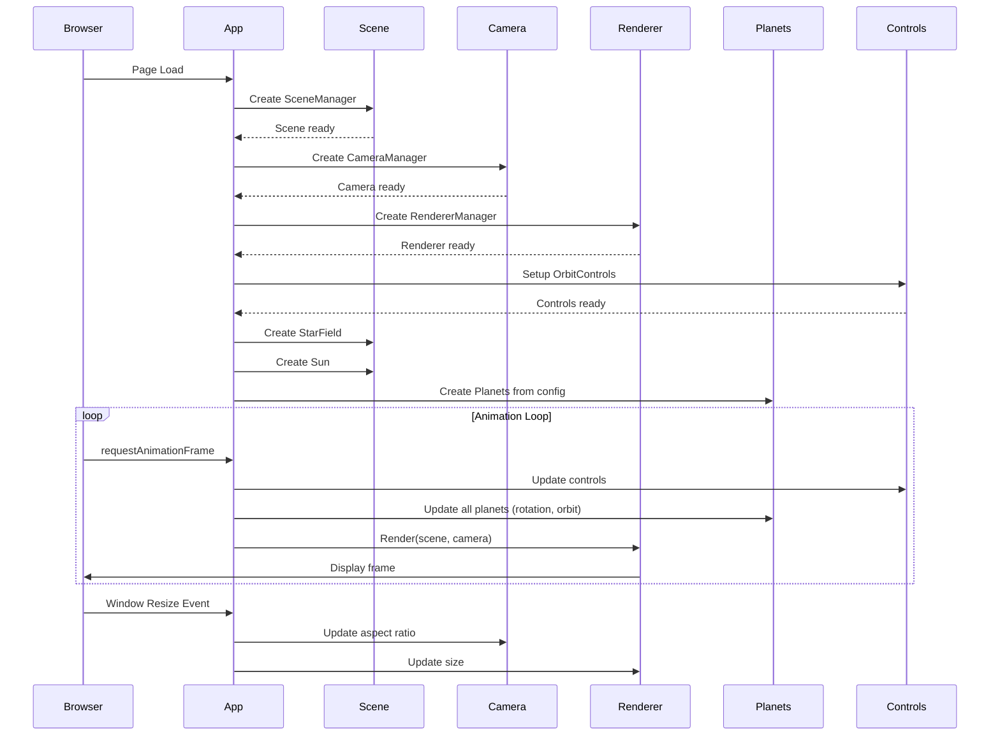

## Data Model

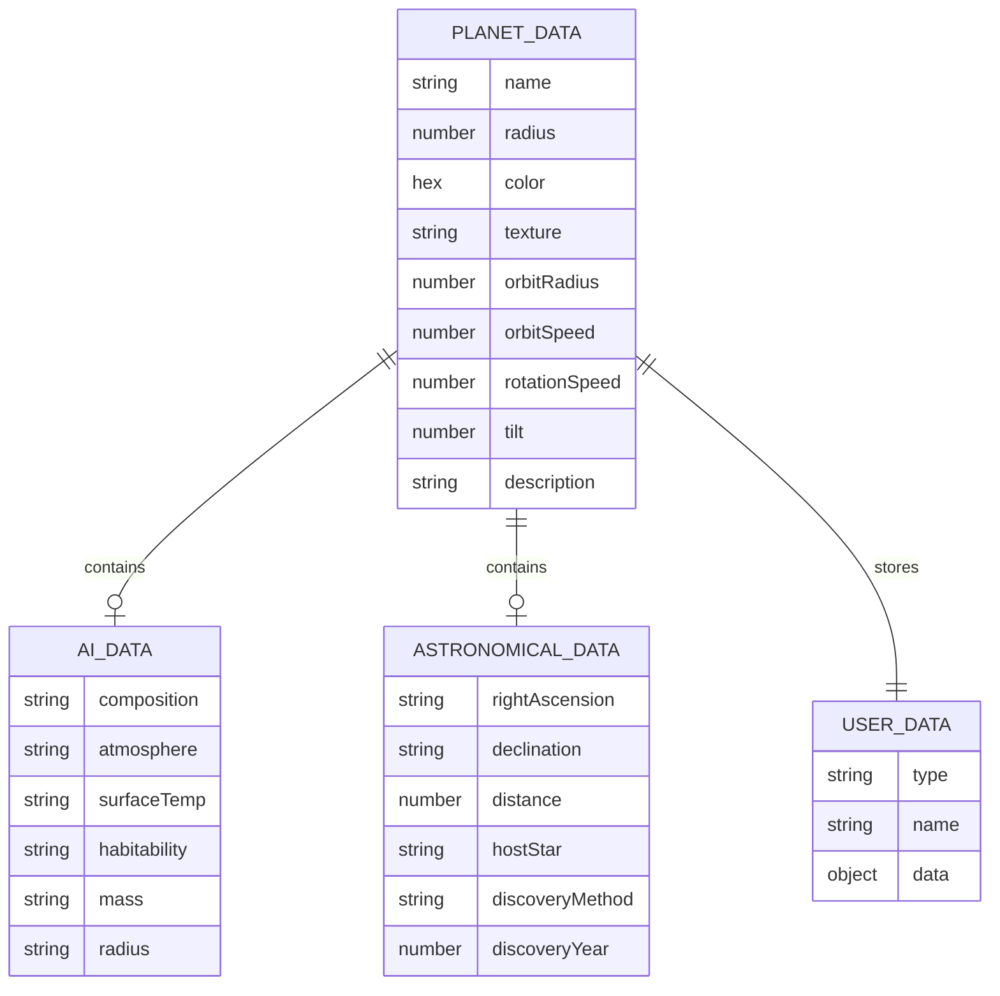

## AI Integration Architecture (Planned)

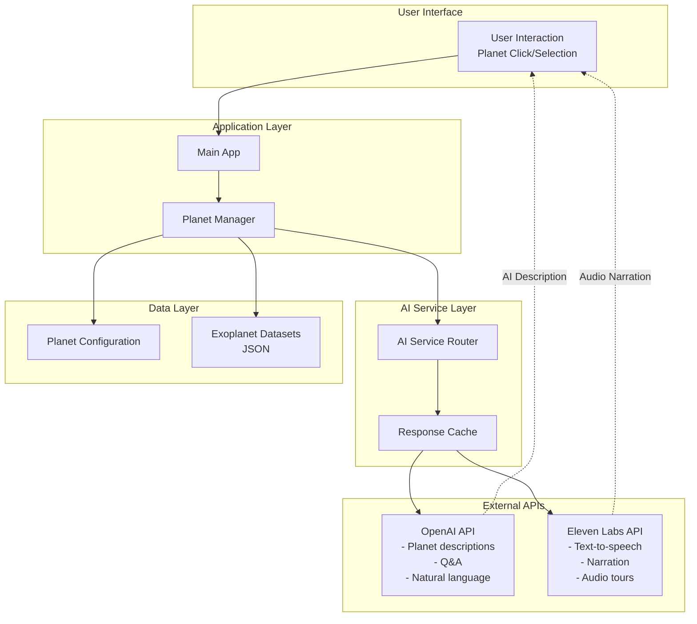

## Technology Stack

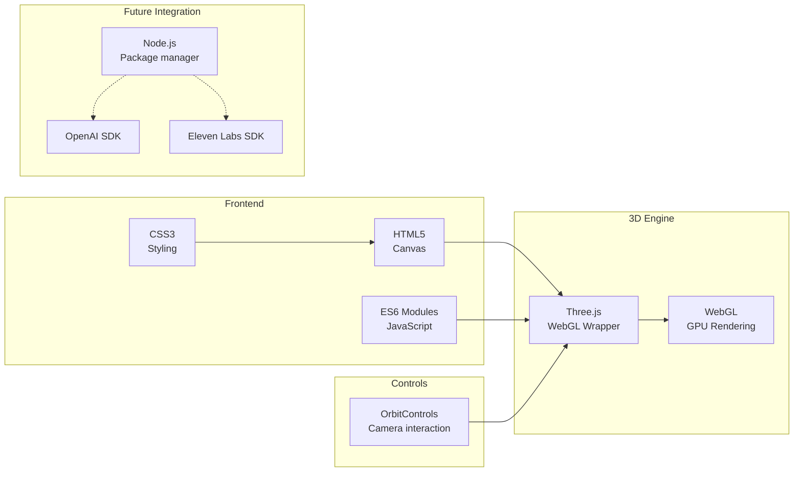

## Design Patterns

### 1. **Manager Pattern**
- SceneManager, CameraManager, RendererManager encapsulate Three.js setup
- Provides clean interfaces for core functionality
- Simplifies testing and maintenance

### 2. **Factory Pattern**
- Planet, Star, and StarField classes create configured objects
- Reusable with different parameters
- Consistent object creation

### 3. **Configuration Pattern**
- Planet data stored in separate configuration file
- Easy to extend with new data sources (JSON datasets)
- Separates data from logic

### 4. **Observer Pattern**
- Event listeners for window resize
- Animation loop using requestAnimationFrame
- Responsive to user input through controls

## Performance Considerations

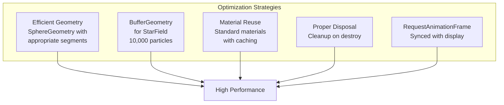

## Extension Points

The architecture is designed for easy extension:

1. **New Celestial Objects**: Extend object classes (Planet, Star)
2. **AI Services**: Add modules in `src/ai/`
3. **Data Sources**: Import JSON datasets via `src/config/`
4. **Controls**: Add interaction modes in `src/controls/`
5. **Visual Effects**: Extend materials and shaders
6. **UI Components**: Add HTML/CSS overlays for information display

## Security & Best Practices

- API keys stored in `.env` (not committed)
- Proper resource disposal to prevent memory leaks
- Error handling for failed API calls
- Rate limiting for external API calls
- Input validation for user data

## Development Workflow

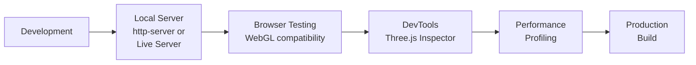

---

**Last Updated**: January 2026  
**Project**: Hamburg AI Hackathon - 3D Space Exploration  
**Version**: 1.0
