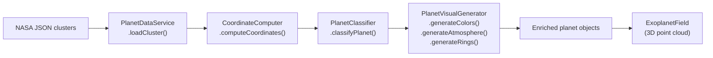
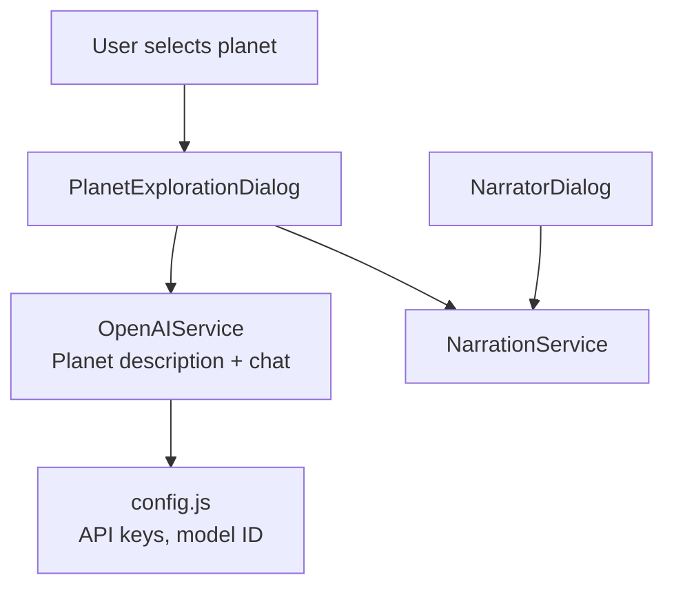

# Architecture Documentation

## Overview

A browser-based 3D space exploration application that renders 6000+ real exoplanets using Three.js, with AI-powered planet descriptions (OpenAI). Pure client-side -- no backend server.

## Technology Stack

| Layer | Technology |
|-------|-----------|
| 3D Engine | Three.js v0.182.0 (WebGL) |
| Build / Dev | Vite |
| AI Text Generation | OpenAI API |
| Module System | ES6 modules |
| Async Processing | Web Workers |

## System Architecture


```mermaid
graph TB
    subgraph "Entry Point"
        HTML[index.html]
        MAIN["main.js (~430 lines)<br/>App Orchestrator"]
    end

    subgraph "Core Layer"
        SCENE[SceneManager]
        CAMERA[CameraManager]
        RENDERER[RendererManager]
        POST[PostProcessing]
    end

    subgraph "Controls Layer"
        INPUT[InputManager<br/>Keyboard + Mouse + Raycasting]
        FLIGHT[FlightControls<br/>Spacecraft Physics]
        PLANETNAV[PlanetNavigator<br/>Search / Teleport UI]
        PLANETSEL[PlanetSelector<br/>Selection Logic]
        CAMCTRL[CameraController<br/>Camera Modes]
        ORBIT[OrbitControls]
    end

    subgraph "Objects Layer"
        PLANET[Planet]
        SPACECRAFT[Spacecraft]
        EXOFIELD[ExoplanetField<br/>6000+ points with LOD]
        STARFIELD[StarField]
        GALAXY[GalaxyField]
        WARP[WarpTunnel]
        DUST[SpaceDust]
        DEBRIS[SpaceDebris]
        STAR[Star]
        UNIVERSE[Universe]
    end

    subgraph "AI Layer"
        OPENAI[OpenAIService]
    end

    subgraph "Services Layer"
        PDS[PlanetDataService]
        CLASSIFY[PlanetClassifier]
        VISUAL[PlanetVisualGenerator]
        COORD[CoordinateComputer]
        NARR[NarrationService]
    end

    subgraph "UI Layer"
        HUD[HUDManager]
        EXPLORE[PlanetExplorationDialog]
        NARRATORDLG[NarratorDialog]
        TARGET[PlanetTargetingSquare]
        LOADING[PartyLoadingScene]
    end

    subgraph "Config"
        CONFIG[config.js<br/>API keys, feature flags]
        PLANETS_CFG[planets.js<br/>Static planet definitions]
    end

    HTML --> MAIN
    MAIN --> SCENE & CAMERA & RENDERER & POST
    MAIN --> INPUT & FLIGHT & PLANETNAV & CAMCTRL
    MAIN --> SPACECRAFT & EXOFIELD & STARFIELD
    MAIN --> HUD & EXPLORE & NARRATORDLG
    MAIN --> PDS

    OPENAI --> CONFIG
    NARR --> OPENAI

    PDS --> CLASSIFY & VISUAL & COORD
    PDS --> EXOFIELD
```

## Module Structure

```
main.js                           # App orchestrator: init, animation loop, wiring
src/
├── ai/
│   └── OpenAIService.js          # Text generation (imports CONFIG for model)
├── config/
│   ├── config.js                 # Central config (env vars, API keys, feature flags)
│   └── planets.js                # Static planet definitions
├── controls/
│   ├── InputManager.js           # Keyboard + mouse + raycasting
│   ├── FlightControls.js         # Spacecraft flight physics
│   ├── PlanetNavigator.js        # Planet search/teleport UI panel
│   ├── PlanetSelector.js         # Planet selection logic
│   ├── CameraController.js       # Camera modes
│   └── OrbitControls.js          # Three.js orbit controls
├── core/
│   ├── Scene.js                  # SceneManager
│   ├── Camera.js                 # CameraManager
│   ├── Renderer.js               # RendererManager
│   └── PostProcessing.js         # Post-processing effects
├── objects/
│   ├── Planet.js                 # Individual planet mesh + textures
│   ├── Spacecraft.js             # Player ship with flight model
│   ├── ExoplanetField.js         # Point cloud for 6000+ exoplanets with LOD
│   ├── StarField.js              # Background stars
│   ├── GalaxyField.js            # Galaxy background
│   ├── WarpTunnel.js             # Warp speed visual effect
│   ├── SpaceDust.js              # Particle effects
│   ├── SpaceDebris.js            # Asteroid debris
│   ├── Star.js                   # Sun/star object
│   └── Universe.js               # Universe container
├── services/
│   ├── PlanetDataService.js      # Data loading orchestrator
│   ├── PlanetClassifier.js       # Pure: type classification by radius/temp
│   ├── PlanetVisualGenerator.js  # Pure: colors, atmosphere, rings
│   ├── CoordinateComputer.js     # Pure: 3D coords from RA/Dec/Distance
│   └── NarrationService.js       # AI narration wrapper
├── ui/
│   ├── HUDManager.js             # HUD updates, UI toggle
│   ├── PlanetExplorationDialog.js # Planet info dialog with AI chat
│   ├── NarratorDialog.js         # AI narration dialog
│   ├── PlanetTargetingSquare.js  # Planet targeting overlay
│   └── PartyLoadingScene.js      # Loading screen
├── utils/
│   ├── TeleportController.js     # Teleport + flash + warp sound
│   ├── textureGenerator.js       # Procedural texture generation
│   ├── PlanetTextureGenerator.js # Solar system specific textures
│   ├── LoadingManager.js         # Loading progress
│   ├── ProximityDetector.js      # Nearest planet detection
│   ├── logger.js                 # Leveled logging
│   └── helpers.js                # Misc utilities
├── shaders/
│   └── AtmosphereShader.js       # GLSL atmosphere
└── workers/
    └── textureWorker.js          # Web Worker for async textures
```

## Data Flow: Exoplanet Pipeline


```mermaid
flowchart LR
    NASA["NASA JSON clusters"] --> PDS["PlanetDataService<br/>.loadCluster()"]
    PDS --> COORD["CoordinateComputer<br/>.computeCoordinates()"]
    COORD --> CLASS["PlanetClassifier<br/>.classifyPlanet()"]
    CLASS --> VIS["PlanetVisualGenerator<br/>.generateColors()<br/>.generateAtmosphere()<br/>.generateRings()"]
    VIS --> ENRICHED["Enriched planet objects"]
    ENRICHED --> EXO["ExoplanetField<br/>(3D point cloud)"]
```

## App Initialization Sequence

```mermaid
sequenceDiagram
    participant Browser
    participant App as main.js (App)
    participant Core as Core Managers
    participant Controls as Controls
    participant Data as PlanetDataService
    participant Objects as Scene Objects
    participant Loop as Animation Loop

    Browser->>App: Page Load
    App->>Core: 1. Create Scene, Camera, Renderer
    Core-->>App: Core ready

    App->>Controls: 2. Create InputManager + HUDManager
    Controls-->>App: Controls ready

    App->>Data: 3. Load NASA clusters
    Data->>Data: CoordinateComputer + Classifier + VisualGenerator
    Data-->>Objects: Enriched planets -> ExoplanetField

    App->>Objects: 4. Create Spacecraft, PlanetNavigator, ExplorationDialog
    App->>Objects: 5. Wire TeleportController

    App->>Loop: 6. Start animation loop
    loop Every Frame
        Loop->>Controls: Update input + flight
        Loop->>Objects: Update spacecraft, planets, effects
        Loop->>Core: Render frame
    end
```

## Scale System

| Domain | Unit | Scale |
|--------|------|-------|
| Scene units | 1 light-year | 10 scene units |
| Global multiplier | -- | 10,000x |
| Solar system | Planetary positions | AU-based |
| Exoplanets | Field coordinates | Light-year based |

## AI Integration


```mermaid
flowchart TB
    USER["User selects planet"] --> EXPLORE["PlanetExplorationDialog"]
    EXPLORE --> OPENAI["OpenAIService<br/>Planet description + chat"]
    EXPLORE --> NARR["NarrationService"]
    OPENAI --> CONFIG["config.js<br/>API keys, model ID"]

    NARRATORDLG["NarratorDialog"] --> NARR
```

Both AI services read API keys and settings from `config.js`, which sources them from environment variables (`.env`).

## Design Patterns

| Pattern | Where | Purpose |
|---------|-------|---------|
| **Manager** | SceneManager, CameraManager, RendererManager | Encapsulate Three.js subsystem setup and lifecycle |
| **Orchestrator** | App class in `main.js` | Thin top-level wiring; delegates all work to subsystems |
| **Pure function extraction** | PlanetClassifier, PlanetVisualGenerator, CoordinateComputer | Stateless transforms, easy to test and reason about |
| **Callback-based DI** | InputManager callbacks | Decouple input detection from action handling |
| **Configuration** | `config.js`, `planets.js` | Centralize all tunables and data definitions |

## Performance Strategies

- **ExoplanetField LOD** -- level-of-detail rendering for 6000+ point cloud
- **Web Worker** (`textureWorker.js`) -- offloads procedural texture generation off the main thread
- **PostProcessing pipeline** -- selective effects application
- **BufferGeometry** -- efficient GPU memory for star fields and particle systems
- **ProximityDetector** -- spatial queries to avoid per-frame full scans

## Security

- API keys stored in `.env` (git-ignored)
- All API calls are client-side fetch -- no secrets on a backend
- Input validation on user chat prompts

---

**Last Updated**: March 2026
**Project**: Hamburg AI Hackathon -- 3D Space Exploration
**Version**: 2.0
