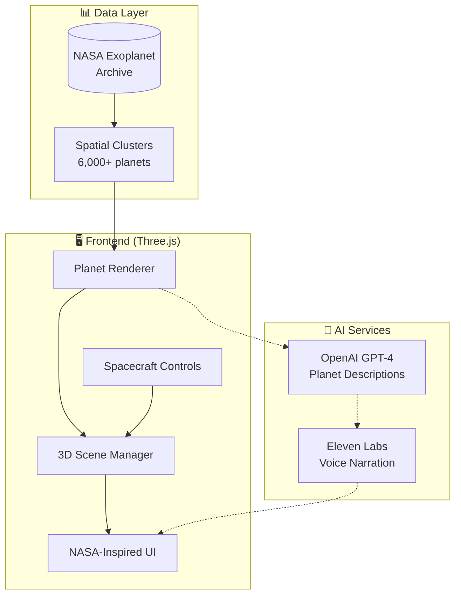

# 🚀 Space Odyssey

> **Explore 6,000+ Real NASA Exoplanets in 3D**

[](https://agentic-space-exploration.pages.dev)

[-gray?style=for-the-badge)](https://zaexv.github.io/agentic-3d-space-exploration-hamburg-ai-hackathon-jan-26/)

[](https://youtu.be/ZdC-fMK62Fg)

> ⚠️ *The GitHub Pages version may be unstable. For the best experience, use the main demo above.*

---

## 🌟 Experience

<div align="center">

| 🪐 Explore | 🤖 AI Companion | 🔊 Voice Narration |
|:---:|:---:|:---:|
| Navigate through real NASA exoplanet data | Get AI-generated descriptions for each world | Listen to planet stories with text-to-speech |

</div>

---

## ✨ Features

🌍 **Real NASA Data** — Powered by authentic NASA Exoplanet Archive data  
🎮 **Immersive Controls** — Fly with keyboard, teleport instantly, switch views  
🤖 **AI Descriptions** — OpenAI-powered planet narratives  
🔊 **Voice Narration** — Eleven Labs text-to-speech integration  
🚀 **Spacecraft Simulation** — Chase camera & cockpit views  
⚡ **Blazing Fast** — Spatial clustering for smooth rendering  

---

## 🏗️ Architecture



---

## 🛠️ Quick Start


```bash
# Clone & Install
git clone https://github.com/Zaexv/agentic-3d-space-exploration-hamburg-ai-hackathon-jan-26.git
cd agentic-3d-space-exploration-hamburg-ai-hackathon-jan-26
npm install

# Run locally
npm run dev
```

---

## 🌌 Data Source

All exoplanet data comes directly from the **[NASA Exoplanet Archive](https://exoplanetarchive.ipac.caltech.edu/)** — the official NASA database of confirmed exoplanets.

---

## 📚 Documentation

- **[START_HERE.md](./START_HERE.md)** - Complete setup and feature guide
- **[Architecture.md](./Architecture.md)** - Technical architecture overview
- **[docs/](./docs/)** - All guides, tutorials, and historical documentation

---

## 👥 Team

Built with ❤️ at **Hamburg AI Hackathon 2026** by **Eduardo Pertierra Puche** & **Irene Granados Montosa**

---

<div align="center">

**[🚀 Launch Demo](https://agentic-space-exploration.pages.dev)** · **[📄 View Code](https://github.com/Zaexv/agentic-3d-space-exploration-hamburg-ai-hackathon-jan-26)**

</div>
